# Custom Emoji List

| Emoji | Suggested Text | Emoji | Suggested Text | Emoji | Suggested Text |
|:-----:|:--------------:|:-----:|:--------------:|:-----:|:--------------:|
|  | :party_corgi: |  | :residentsleeper: |  | :thatd-be-great: |
|  | :reeeeeeeeeeeeeeeeeeeeeeeeeeeeeeeeeeeeeeeeeeeeeeeeeeeeeeeeeeeeeeeeeeeeeeeeeeeeeeee: |  | :shame: |  | :mexico: |
|  | :yolo: |  | :poowalk: |  | :deefsmith: |
|  | :dank: |  | :quackers: |  | :xbox: |
|  | :otto: |  | :mtg-white: |  | :ha-ha: |
|  | :skype_doh: | 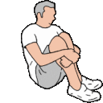 | :try-not-to-cry: |  | :dontpanic: |
|  | :scumbag_tfl: |  | :hermanmillerofficechair: |  | :crunch: |
|  | :kapkan_r6: |  | :melted_face: |  | :coolcat2: |
|  | :jager_r6: |  | :lacroix: |  | :gary_the_snail: |
|  | :bullwhip: |  | :bcuz: |  | :ytho_jesus: |
|  | :disapproval: |  | :q: |  | :icwatudid: |
|  | :parrotwave5: |  | :canary: |  | :pppd: |
|  | :blackmage: |  | :coolcoolcoolcoolcool: |  | :leftshark: |
|  | :mindblown: |  | :hammertime: |  | :saturday: |
|  | :mockingjay: |  | :ruhroh: |  | :nessded: |
|  | :grumpy_cat: |  | :tachanka_r6: |  | :oregon_back: |
|  | :shebang: |  | :cera: |  | :suspect: |
|  | :firehose: |  | :zen: |  | :butter: |
|  | :rightparrot: |  | :rage4: |  | :party_parrot: |
|  | :sandstorm: |  | :platform_2_point_0_will_fix_this: |  | :first: |
|  | :coconut: |  | :scotland: |  | :the_flying_dutchman: |
|  | :excalibur: | 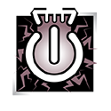 | :thatcher_r6: |  | :aww: |
|  | :brain_enormous: |  | :garlic: |  | :public_library: |
|  | :lmao: |  | :piratecat: |  | :katrina: |
|  | :domo: |  | :mtg_w: |  | :sbk: |
|  | :mine: |  | :stegosaurus: |  | :always-watching: |
|  | :shipit_parrot: |  | :blessed: |  | :grimace: |
|  | :snorlax: |  | :datas: |  | :william: |
|  | :cubimal_chick: |  | :party_dumpsterfire: |  | :degreemap_legacy: |
|  | :stone: |  | :girneck: |  | :party_violence: |
|  | :rousey: |  | :bandaid: |  | :pritunl: |
|  | :c_sharp: |  | :gremlin: |  | :corgi_parrot: |
|  | :bbq: |  | :makeitso: |  | :triplets_parrot: |
|  | :snap: |  | :pidgey: |  | :upset: |
|  | :nessheart: |  | :m8: |  | :coach: |
|  | :chupacabra: |  | :i-guess: |  | :nelson: |
|  | :swingline: |  | :fiestaparrot: |  | :wubba_lubba_dub_dub: |
|  | :coffee_parrot: | 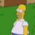 | :homer_simpson_bush: |  | :nuke: |
|  | :sad: |  | :bsod: |  | :longhorns: |
|  | :salt: |  | :dealwithit: |  | :jbg: |
|  | :trollface-right: |  | :schwarma: |  | :scumbag_apple: |
|  | :party_pika: |  | :mtg_c: |  | :waterbear: |
|  | :fox: |  | :shot_glass: |  | :love: |
|  | :db: |  | :pinky_promise: | 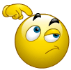 | :scratch_head: |
|  | :takemymoney: |  | :slowpoke: |  | :piggy: |
|  | :troll-period: |  | :wtf: | 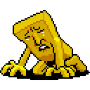 | :canteven: |
|  | :uff_da: |  | :beer_pong: |  | :fine: |
|  | :ponyta: |  | :loading: |  | :yawn: |
|  | :whyyy: |  | :belongs_in_the_trash: |  | :footbo: |
|  | :vibraslap: |  | :friendship_trophy: |  | :skype_worried: |
|  | :patrick_star: |  | :data: |  | :lighthouse: |
|  | :palmface: |  | :parrotcop: |  | :portal-blue: |
| 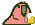 | :happy_hour_parrot: | 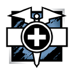 | :doc_r6: |  | :timbs: |
|  | :workwork: |  | :kohlrabi: |  | :gran: |
|  | :cowboys: |  | :love_parrot: |  | :mario_block: |
|  | :thats-what-i-like: |  | :doot: |  | :chillparrot: |
|  | :coding-cowboy: |  | :dusty_stick: |  | :computer_rage: |
|  | :mtg_tap: |  | :featuring_dante_from_the_devil_may_cry_series: |  | :azflag: |
|  | :magikarp: |  | :masshole: |  | :cucumber_cool: |
|  | :fidget: |  | :squirrel: |  | :huge_metal_fan: |
|  | :dolan-classic: |  | :fail: |  | :partyparrot: |
|  | :coolcat: |  | :neutral: |  | :skype_penguin: |
|  | :arcenciel: |  | :btc: |  | :magic-eight-ball: |
|  | :emoticon_not_emoji: |  | :hawkward: |  | :thermite_r6: |
|  | :tardis: |  | :doge: |  | :swear: |
|  | :nyanbow: |  | :tetris: |  | :civitas: |
|  | :kroeger_overlord: |  | :bear_hug: |  | :backtick: |
|  | :gavin_cat: |  | :epic-sax-guy: |  | :rastacat: |
|  | :montagne_r6: |  | :elf: |  | :kramer: |
|  | :tacodog: |  | :ni: |  | :shallot: |
| 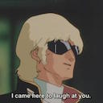 | :i_came_here_to_laugh_at_you: |  | :waiting-spongebob: |  | :trollface: |
|  | :dumpsterfire: |  | :pipe: |  | :goblue: |
|  | :chameleon: |  | :netflix: |  | :oko: |
|  | :javascript: |  | :frost_r6: |  | :lucascry: |
|  | :the_scream: |  | :pride: |  | :air-quote-left: |
|  | :corgi2: |  | :rick: |  | :mario_jump: |
|  | :8bitrip: |  | :boredparrot: |  | :ankylosaurus: |
|  | :these_hands: |  | :nooice: |  | :wee: |
|  | :yall_come: |  | :groot_pot: |  | :eeexcellent: |
|  | :ohioflag: |  | :mei: |  | :punchtrees: |
| 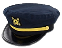 | :teamcaptain: |  | :cereal: |  | :pterodactyl: |
|  | :bonzibuddy: |  | :badpoker: |  | :hehehe: |
|  | :foolsgold: |  | :asics: |  | :snooze: |
|  | :mustache: |  | :bulbasaur: |  | :feels-good-man: |
|  | :yea: |  | :juggalo: |  | :bass: |
|  | :butthead: |  | :safe: |  | :scumbag_jenkins: |
|  | :brain: |  | :halal_parrot: |  | :jackie_chan: |
|  | :bad_joke_eel: |  | :nastygirl: |  | :salad: |
|  | :jigglypuff: |  | :grateful: |  | :ice-cream-parrot: |
|  | :milo: |  | :notsureif: |  | :nuclear: |
|  | :arch: |  | :pika: |  | :bat-signal: |
|  | :scumbag_gh: |  | :headvswall: |  | :winrar: |
|  | :kadabra: |  | :sxsw: |  | :aw-yiss: |
|  | :fishbulb: |  | :thompson: |  | :i-guess-with-emphasis: |
|  | :poo: |  | :brexit: |  | :nessburnt: |
|  | :classy: |  | :celeryman: | 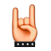 | :metal: |
|  | :bob: |  | :hookem2: |  | :yodawg: |
|  | :hrwhistle: |  | :degreemap: |  | :helpcomputer: |
|  | :pancakes: |  | :shrug: |  | :scumbag_burning_glass: |
|  | :apatosaurus: |  | :lint: |  | :business: |
|  | :feelsgoodman: |  | :gottarun: |  | :colellipsis: |
|  | :teehee: |  | :op: | 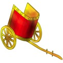 | :chariot: |
| 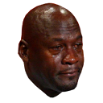 | :crying_jordan: | 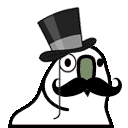 | :gentleman_parrot: |  | :glitter-rainbow2: |
| 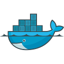 | :docker: |  | :feels-bad-man: | 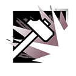 | :sledge_r6: |
|  | :pretzel: |  | :bowtie: |  | :housestark: |
|  | :brit: |  | :pun: |  | :omgmetrics: |
|  | :smoke_r6: |  | :whowouldwin: |  | :rubiks_cube: |
|  | :wakko: |  | :party_fidget_spinner: |  | :scumbag_chupacabra: |
|  | :sloth: |  | :edfi: |  | :scumbag_java: |
| 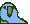 | :parrotwave2: |  | :papabless: |  | :guy_fieri: |
|  | :mrv: |  | :beryl: |  | :lambda: |
|  | :virus: | 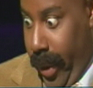 | :say_what: |  | :new_mexico: |
|  | :jerry: |  | :party_frog: |  | :nucular: |
|  | :mock: |  | :horsea: |  | :plank: |
|  | :face_with_one_eyebrow_raised: |  | :scumbag_highcharts: |  | :diablo: |
|  | :slack: |  | :goberserk: |  | :sif: |
|  | :maryjane: |  | :pitchfork: |  | :avocado: |
|  | :nod: |  | :redmage: |  | :gooby: |
|  | :bagel: |  | :ditto: |  | :copstop: |
|  | :rollsafe: |  | :scumbag_elevio: |  | :ito_en: |
| 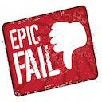 | :epic_fail: |  | :squirtle: |  | :skype_puke: |
|  | :creeper: |  | :sift3d: |  | :panicbasket: |
|  | :banana_parrot: |  | :lovecat: |  | :cant_even: |
|  | :limewire: |  | :test: |  | :wfh_parrot: |
|  | :glitter-butterfly: |  | :rivera_rockcrusher: |  | :dogezzz: |
|  | :paula: |  | :sandy_cheeks: |  | :betterkolache: |
|  | :state_of_jefferson: |  | :kappa: |  | :uffda: |
|  | :air-quote-right: |  | :shroom: |  | :rage3: |
|  | :supersmiley: |  | :xmen: |  | :chbox_twenty_off_the_multi-platinum_album_supernatural: |
|  | :high: |  | :brain_tiny: |  | :buck_r6: |
|  | :pacman: |  | :table_flip: |  | :floof: |
|  | :mtg_g: |  | :jeffjump: |  | :llap: |
|  | :kenan: |  | :id-rather-be-listening-to-the-grammy-award-winning-1999-hit-smooth-by-santana-feat-rob-thomas-of-mat: |  | :party_cat: |
|  | :dogeza: |  | :moto: |  | :twins_parrot: |
|  | :success: |  | :wat: |  | :aa: |
|  | :cthulhu: |  | :mtg_b: | 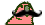 | :parrotmustache: |
|  | :thanks: |  | :charmander_dancing: |  | :champ: |
|  | :trademark: |  | :imwithher: |  | :why-not-zoidberg: |
|  | :moneytree: |  | :rage1: |  | :pulse_r6: |
|  | :release: |  | :neckbeard: |  | :girhead: |
|  | :fu: |  | :blonde_sassy_parrot: |  | :larry: |
|  | :hmmm: |  | :gramble: |  | :pokeball: |
|  | :yay: |  | :old_man_yells_at_cloud: |  | :explodyparrot: |
|  | :skype_rainbow: |  | :kazoo: |  | :model: |
|  | :gainz: |  | :fist_bump: |  | :onion: |
|  | :george: |  | :tyrannosaurus: |  | :gengar: |
|  | :tribble: |  | :thumbsup_all: |  | :mustard_greens: |
|  | :sorry_dave: |  | :goomba: |  | :party-dinosaur: |
|  | :hypnotoad: |  | :puravida: | 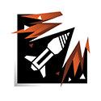 | :ash_r6: |
|  | :polvos: |  | :piedpiper: | 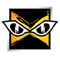 | :iq_r6: |
|  | :yesss: |  | :partywizard: |  | :bae: |
|  | :vim: | 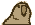 | :oldtimeyparrot: |  | :speechless: |
|  | :pickle: |  | :gothparrot: |  | :ythocat: |
|  | :sadpanda: |  | :escalator: | 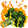 | :broclit: |
|  | :rice_u: |  | :cellphone: |  | :twss: |
|  | :thicc_vegan_wife: |  | :recorder: |  | :nooice2: |
|  | :404: |  | :slavoj_zizek: |  | :slowparrot: |
|  | :kale: |  | :yey: |  | :poojump: |
|  | :dubcat: |  | :godmode: |  | :dharbin: |
|  | :thatfeel: |  | :tips_fedora: |  | :lolwut: |
|  | :thatwaseasy: |  | :dankengine: |  | :over9k: |
|  | :fastparrot: |  | :scumbag_docker: |  | :angery: |
|  | :scumbag_excalibur: |  | :you-cant-if-you-dont: |  | :badger: |
|  | :badgerbadger: |  | :b_r_b: |  | :winders: |
|  | :drums: |  | :angular: |  | :indubitably: |
|  | :moustache: |  | :bazinga: |  | :parrotwave4: |
| 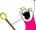 | :allthethings: |  | :tayne_beta: |  | :poomeditate: |
|  | :coachz: |  | :rl: |  | :successful: |
|  | :congaparrot: |  | :gameboycat: |  | :gendo: |
|  | :carrot: |  | :surprise: |  | :torch: |
|  | :help_please: |  | :sad_party_panda: |  | :nyan: |
|  | :empire: |  | :zucchini: |  | :clown: |
| 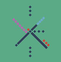 | :pdx: |  | :ness: |  | :okawaii: |
|  | :slidewhistle: | 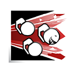 | :fuze_r6: |  | :fwp: |
|  | :mega-rage: |  | :pirate: |  | :omanyte: |
|  | :dididothat: |  | :pop_tart: |  | :do-not-want: |
|  | :lettuce: |  | :quiterly: |  | :badmodel: |
|  | :trescomas: |  | :hacks: |  | :nay: |
|  | :iron: | 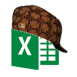 | :scumbag_excel: |  | :no_shame: |
|  | :bogs: |  | :nessbike: |  | :srsly: |
|  | :sad_tom_brady: |  | :sparky: |  | :kebab: |
|  | :mtg_u: |  | :pizza_parrot: |  | :adeptus_astartes: |
|  | :yao: |  | :bye_felicia: |  | :parrotwave7: |
|  | :octocat: |  | :soylent: |  | :please: |
|  | :yo: |  | :crickets: |  | :brain_huge: |
|  | :mario_standing: | 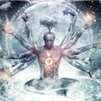 | :brain_cosmic: |  | :flag-tx: |
|  | :maryland: |  | :axe: |  | :nope2: |
|  | :california: |  | :emoji_spacer: |  | :doh: |
|  | :bueller_bueller: |  | :skater: |  | :aesthetic: |
|  | :tr8r: |  | :chadsthree: |  | :paulawalk: |
|  | :lizard: |  | :breakdance: |  | :nesszzz: |
|  | :khunter: |  | :scumbag_salesforce: |  | :village: |
|  | :megaman: |  | :demo2win: |  | :angry-skeletor: |
|  | :kwalk: |  | :okilly_dokilly: |  | :overwatch: |
|  | :glaz_r6: |  | :raspberry: |  | :cry-a-lot: |
|  | :nocturnal: |  | :mtg-red: |  | :secretsquirrel: |
|  | :a_sink: |  | :aint-nobody-got-time-for-that: |  | :canes: |
|  | :wow: |  | :koolaid: |  | :smoothie: |
| 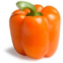 | :bellpepper: |  | :nessbotded: |  | :okiedokie: |
|  | :kujayhawk: |  | :blinky: |  | :geodude: |
|  | :sock: |  | :mango: |  | :shuffleparrot: |
|  | :feelsbad: |  | :steve_from_smashmouth: |  | :missingno: |
|  | :rube: |  | :peetza: |  | :blaziken: |
|  | :jenkins: |  | :beavis: |  | :rebel: |
|  | :kolache: |  | :scumbag_datatables: |  | :party_sad_panda: |
|  | :rekt: |  | :coin: |  | :simple_smile: |
|  | :student_success_rat: |  | :pp: |  | :cornholio: |
|  | :themostinnovativeproductsofalltimes: |  | :parrotwave1: |  | :biggie: |
|  | :thumbsup_drumpf: |  | :oyster_smiling: |  | :monster: |
|  | :guise: |  | :wu: |  | :indeed: |
|  | :mute_r6: |  | :python: |  | :tacocat: |
|  | :inlove: |  | :hodor: |  | :frankerz: |
|  | :ytho: |  | :drill: |  | :proportional: |
|  | :harambe: |  | :guy_fieri_parrot: |  | :nessbot: |
|  | :lolwat: |  | :yiss: |  | :vince: |
|  | :sifted: |  | :yi: |  | :csagan: |
|  | :build_failure: |  | :civsenpai: |  | :spooky_action_at_a_distance: |
|  | :legion: |  | :jeorb: |  | :batman_logo: |
|  | :reversecongaparrot: |  | :nope: |  | :gyarados: |
|  | :barks_internally: |  | :turkey2: |  | :terminal: |
|  | :illaminate: |  | :oregon: |  | :kon: |
|  | :rumham: |  | :peanut_butter_jelly_time: |  | :data_apocalypse: |
|  | :believeland: |  | :pii: |  | :ultimate: |
| 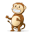 | :skype_monkey: |  | :big_boss_salute: |  | :new_relic: |
|  | :ackbar: |  | :damn: |  | :parrotwave3: |
|  | :quality: |  | :consuela: |  | :dikembe: |
|  | :geodude2: |  | :yase: |  | :harambe2: |
|  | :brain_medium: |  | :broccoli: |  | :zombiecat: |
|  | :spooky_ytho: |  | :chuys: |  | :kentucky: |
|  | :build_success: |  | :programming: |  | :downvote: |
|  | :wut: |  | :squidward: |  | :thumbsupparrot: |
|  | :merged: |  | :vaultboy: |  | :bandit: |
|  | :nice: |  | :cowboy: |  | :mtg-green: |
|  | :party_trash_dove: | 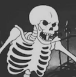 | :spooky_skelinton: | 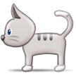 | :samsung_cat: |
|  | :raging: |  | :tpope: |  | :dolan: |
|  | :false: |  | :la_croix: |  | :deadhorse: |
|  | :viking: |  | :flinstones: |  | :icanhaz: |
|  | :texas: |  | :giveenergy: |  | :orly: |
|  | :litten: |  | :geass: |  | :this-is-fine: |
|  | :facepalm: |  | :vinyl: | 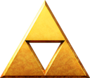 | :triforce: |
|  | :parrotdad: |  | :scumbagk8s: |  | :twitch_r6: |
|  | :fatherchristmas: |  | :skypecool: | 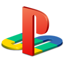 | :playstation: |
|  | :pistachio: |  | :chuck_norris: |  | :noodles: |
|  | :cuba: |  | :no_cars: |  | :drunk: |
|  | :party_carrot: |  | :troll-exclamation: |  | :falcon: |
|  | :science_parrot: |  | :fuego: |  | :waffle: |
|  | :bartleby: |  | :totoro: |  | :brah: |
|  | :shufflefurtherparrot: |  | :illume: |  | :beercat: |
|  | :shh: |  | :philosoraptor: |  | :nonono: |
|  | :bacon: |  | :one_ring: |  | :nice: |
|  | :postgres: |  | :mtg_r: |  | :glitter-rainbow1: |
|  | :scumbag_js: |  | :hoot_me: |  | :bandit_r6: |
|  | :killmenow: |  | :mtg-blue: |  | :bib: |
|  | :darkside: |  | :al-arabiyyah: |  | :brain_small: |
| 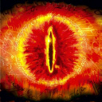 | :sauron: |  | :atom: |  | :spacedolphinparty: |
|  | :same: |  | :goof: |  | :party_charmander: |
|  | :stevesone: |  | :feelsgood: |  | :i-lied: |
| 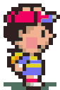 | :nesswalk: |  | :linkrip: |  | :one-does-not-simply: |
|  | :mac: |  | :dew: |  | :youearnedit: |
|  | :dealwithitparrot: |  | :cowmoon: |  | :gitcat: |
|  | :slack_call: |  | :rtj1: |  | :goku: |
|  | :sandwich: |  | :kevin: |  | :itsarly: |
|  | :portal-orange: |  | :sleepy_parrot: |  | :bagheera: |
|  | :troll-dance: |  | :l-boogie: |  | :nyan_parrot: |
|  | :falafel: |  | :dragonite: |  | :salute: |
|  | :corgi: |  | :thumbsupobama: |  | :wat: |
|  | :crossed: |  | :react: |  | :carl: |
|  | :browsers: |  | :sadparrot: |  | :rest_in_peace: |
|  | :chico: |  | :rubber_duck: |  | :kube: |
|  | :morty: |  | :haha-funny: |  | :bobdobbs: |
|  | :firesquirrel: |  | :not-bad: |  | :linux: |
|  | :peace_be_your_journey: |  | :mario_pipe: |  | :spacedolphin: |
|  | :hurtrealbad: |  | :elasticsearch: |  | :arbys: |
|  | :upvote_parrot: |  | :sneeze: |  | :hellsport: |
|  | :yoga: |  | :litaf: |  | :do_it: |
|  | :chefdog: |  | :n64: |  | :cage: |
|  | :cabbage: |  | :giftcat: |  | :tthelmet2: |
|  | :scumbag_auth0: |  | :binoculars: |  | :spongebob: |
|  | :super_hot_fire: |  | :derp: |  | :reasons: |
|  | :eevee: |  | :feels-good: |  | :thumbsuprambo: |
|  | :nesspj: |  | :n00b: |  | :costanza: |
|  | :diglett: |  | :ffwiz: |  | :bastion: |
|  | :upvote: |  | :like: |  | :sad_panda: |
|  | :nods: |  | :allthejorbs: |  | :anitear: |
|  | :party_try_not_to_cry: | 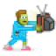 | :tvbinge: | 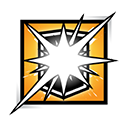 | :blitz_r6: |
| 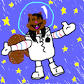 | :grace-of-space: |  | :rage2: |  | :scumbag_css: |
|  | :whichwich: |  | :beet: |  | :goldblum: |
|  | :doit: |  | :middleparrot: |  | :illuminati: |
|  | :aussieparrot: |  | :cubone: |  | :tacotrail: |
|  | :skype_champagne: |  | :topo_chico: |  | :propane: |
|  | :devops: |  | :tt2: |  | :ganymede: |
| 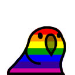 | :pride_parrot: |  | :partycat: |  | :dull: |
|  | :girbody: |  | :vaca_aquatica: | 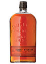 | :burb: |
|  | :ralpherz: |  | :kjump: |  | :wfo_parrot: |
|  | :jira_bug: |  | :ou: |  | :lol: |
|  | :sssss: |  | :party_rage_sad_panda: |  | :happening: |
|  | :cap: |  | :civitas_feels_bad_man: |  | :parrotwave6: |
|  | :charmander: |  | :radioactive: |  | :rtj2: |
|  | :batman: |  | :jeff: |  | :spock: |
|  | :troll-question: |  | :barbs: |  | :notlikethis: |
|  | :ufo: |  | :elaine: |  | :failed: |
|  | :mtg-black: |  | :murica: |  | :brbs: |
|  | :moto2: |  | :finnadie: |  | :brachiosaurus: |
|  | :naan: | 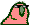 | :shufflepartyparrot: |  | :sonogram_jesus: |
|  | :skype_nerd: |  | :nitrogen: |  | :drop_mic: |
|  | :beard: |  | :party_sad_panda1: |  | :brain_big: |
|  | :et: |  | :tired-spongebob: |  | :hotpocket: |
| 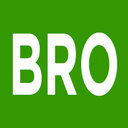 | :bro: |  | :jira: | 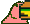 | :hamburger_parrot: |
|  | :fingerscrossed: |  | :glitch_crab: |  | :reese: |
|  | :impossibru: |  | :clapping: |  | :aloe: |
|  | :goose: |  | :doritos: |  | :kronos: |
|  | :dba: | 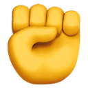 | :leftfist: |  | :scumbag_spark: |
|  | :waka_waka: |  | :alpaca: |  | :castle_r6: |
|  | :roflcopter: |  | :droppingcigarettes: |  | :doot_cone: |
|  | :which-is-nice: |  | :tofu: |  | :rook_r6: |
|  | :party_goat: |  | :giggle: |  | :jacket: |
|  | :corgi3: |  | :flip_cup: |  | :me_gusta: |
|  | :scumbag_aws: |  | :ohyou: |  | :bork: |
|  | :ceds: |  | :arcanine: |  | :jeffwalk: |
|  | :paulrevere: |  | :rainbow-drool: |  | :witness_protection_parrot: |
|  | :pkat: |  | :ohok: |
